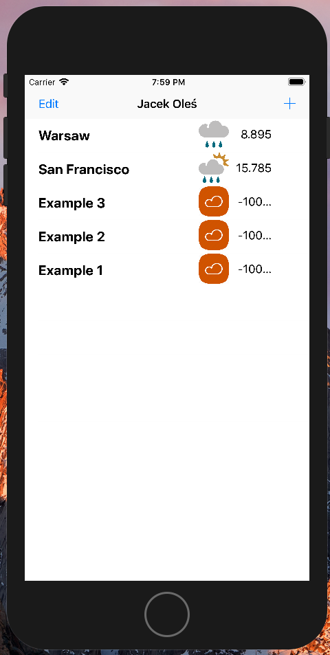
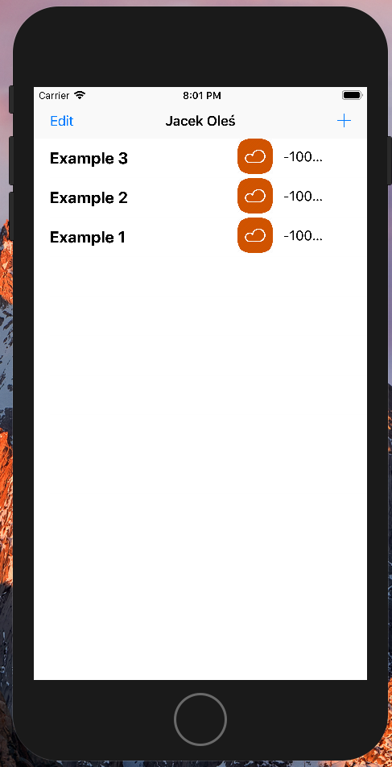
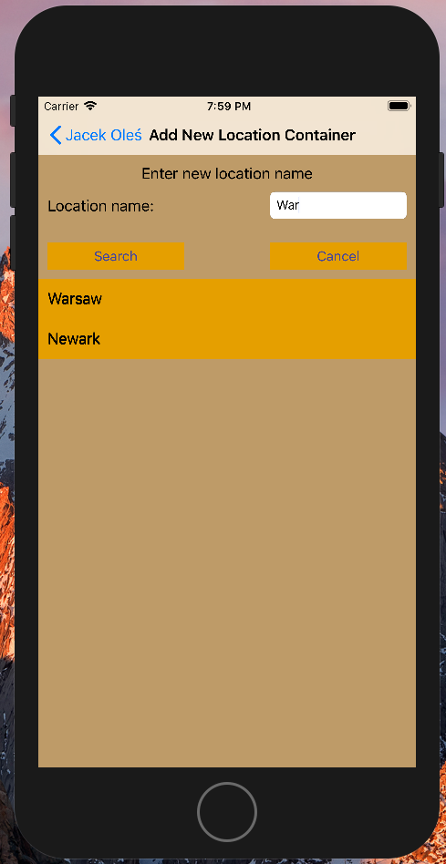
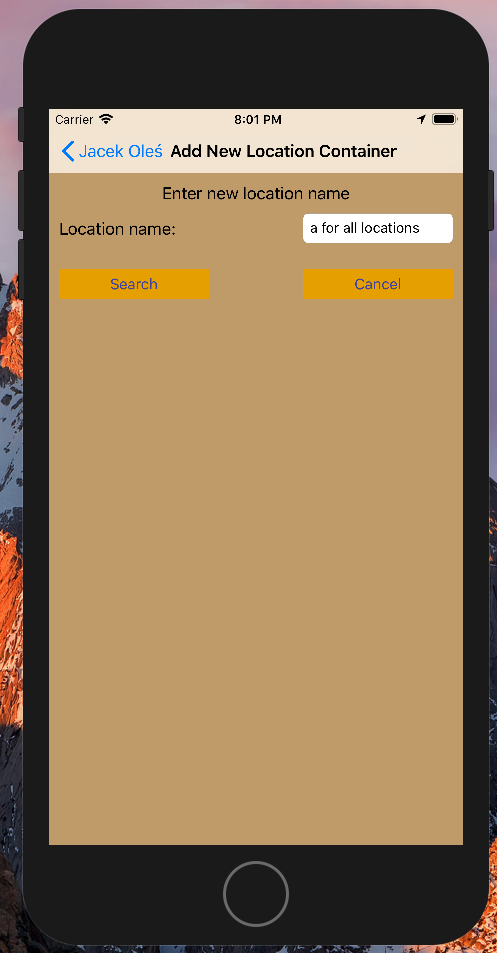
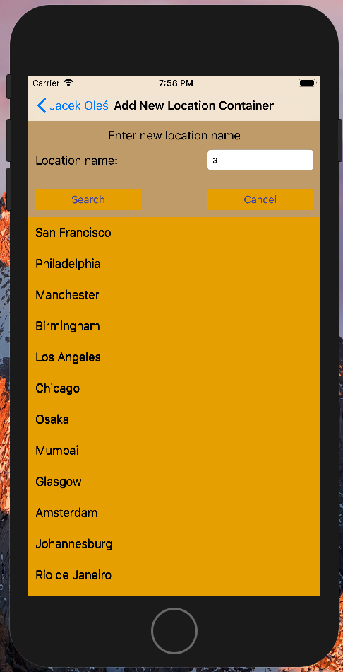
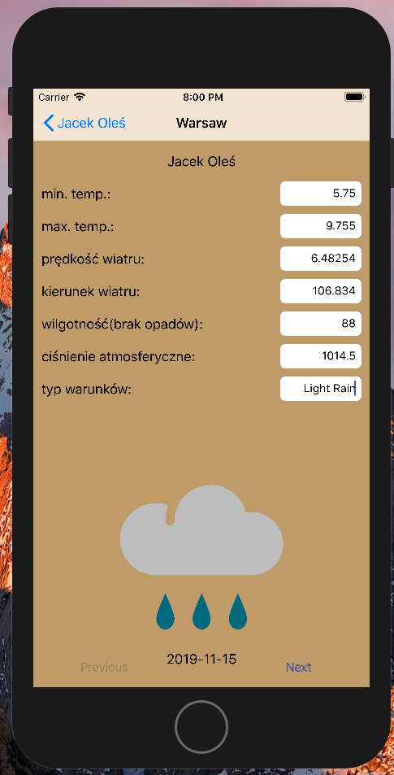

# WeatherForecast_App_Swift_IOS
Weather Forecast Application written in Swift for iOS

Application uses [MetaWeather API](https://www.metaweather.com/api/) to fetch weather data

Application utilizes Master-Detail and Table views in Swift programming language for iOS

Application was created using Storyboard

## Screens

##### Master (locations) views:

##### Add (and search for new location) views:

  

##### Detail (location) view:

